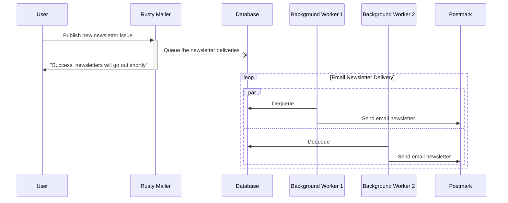

<div id="top"></div>

<!-- PROJECT LOGO -->
<br />
<div align="center">
  <h1 align="center">Rusty Mailer</h1>

  <p align="center">
    A simple but fault-tolerant and well-tested email delivery service.
  </p>
  
  <div align="center">
  
  [![Stargazers][stars-shield]][stars-url]
  [![Issues][issues-shield]][issues-url]
  [![MIT License][license-shield]][license-url]

  </div>
</div>


<!-- TABLE OF CONTENTS -->
<!-- <details>
  <summary>Table of Contents</summary>
  <ol>
    <li>
      <a href="#about-the-project">About The Project</a>
      <ul>
        <li><a href="#built-with">Built With</a></li>
      </ul>
    </li>
    <li>
      <a href="#getting-started">Getting Started</a>
      <ul>
        <li><a href="#prerequisites">Prerequisites</a></li>
        <li><a href="#installation">Installation</a></li>
      </ul>
    </li>
    <li><a href="#usage">Usage</a></li>
    <li><a href="#roadmap">Roadmap</a></li>
    <li><a href="#contributing">Contributing</a></li>
    <li><a href="#license">License</a></li>
    <li><a href="#contact">Contact</a></li>
    <li><a href="#acknowledgments">Acknowledgments</a></li>
  </ol>
</details> -->


<!-- ABOUT THE PROJECT -->
## About The Project

Rusty Mailer is a practice project using Rust, it's a simple email newsletter delivery 
service where users can publish newsletter issues to their subscribers. 
It features some degree of fault-tolerance and well-tested codebase. Built using Rust 
and Actix Web, it was a project from the book [Zero to Production in Rust](https://zero2prod.com).

To achieve fault-tolerance, email newsletter deliveries are done asynchronously by 
queueing the delivery in the database, then background workers will dequeue it periodically. 

The following is the diagram:


PostgreSQL table is utilized as the queue, background workers will pick 1 row to process everytime it does 
dequeue operation and then delete the row immediately after it succeeded processing.
PostgreSQL's [row-level locking](https://www.postgresql.org/docs/current/explicit-locking.html) 
is utilized to prevent multiple background workers from processing the same row, 
thus preventing duplicate email delivery.

The following diagram illustrates what would happen when there are 2 rows (row A and row B) in the table 
and two workers do dequeue operation concurrently:

```mermaid
sequenceDiagram
    participant Worker 1
    participant Worker 2
    participant Database
    
    par Worker 1 tries to process row A
      rect rgb(180, 150, 50)
        alt Row A is not locked
          Worker 1->>Database: Processes row A
        else Row A is locked
          Worker 1->>Database: Processes row B
        end
      end
    and Worker 2 tries to process row A
      rect rgb(50, 50, 50)
        alt Row A is not locked
          Worker 2->>Database: Processes row A
        else Row A is locked
          Worker 2->>Database: Processes row B
        end
      end
    end
```



### Built With

* [![Rust][rust-shield]][rust-url]
* [![PostgreSQL][postgre-shield]][postgre-url]
* [![Redis][redis-shield]][redis-url]
* [![Actix Web][actix-web-shield]][actix-web-url]
* [![Postmark][postmark-shield]][postmark-url]

<p align="right">(<a href="#top">back to top</a>)</p>


<!-- GETTING STARTED -->
## Getting Started
### Prerequisites
- Docker;
- Rust;
- SQLX-cli, install using `cargo install sqlx-cli`;
- PostgreSQL.

### Running Locally
1. Clone the repo and `cd` into the directory;
2. Run the following command:
```bash
scripts/init_db.sh && scripts/init_redis.sh
```
3. Run `cargo run`
4. The web can be accessed at [localhost:8081](http://localhost:8081);
5. Go to `localhost:8081/login` to login, use "admin" for username, and "everythinghastostartsomewhere" for the password.

<p align="right">(<a href="#top">back to top</a>)</p>

<!-- ROADMAP -->
## Roadmap

- [ ] Deploy to a cloud provider
- [ ] Create automated deployment pipeline
- [ ] API docs (Swagger)
- [ ] Revamp UI

See the [open issues][issues-url] for a full list of proposed features (and known issues).

<p align="right">(<a href="#top">back to top</a>)</p>


<!-- LICENSE -->
## License

Distributed under the MIT License. See [LICENSE][license-url] for more information.

<p align="right">(<a href="#top">back to top</a>)</p>


<!-- CONTACT -->
## Contact

[![Twitter][twitter-shield]][twitter-url] 
[![LinkedIn][linkedin-shield]][linkedin-url] 
[![Email][gmail-shield]][mail-url]

<p align="right">(<a href="#top">back to top</a>)</p>


<!-- ACKNOWLEDGMENTS -->
## Acknowledgments

Much thanks to these people/organizations/resources that made this project possible to be as it is now!

* [Zero 2 Production in Rust Book](https://zero2prod.com)
* [Luca Palmieri (Author of zero2prod.com)](https://lpalmieri.com)
* [Rust Programming Language][rust-url]
* [PostgreSQL][postgre-url]
* [Redis][redis-url]
* [Actix Web][actix-web-url]
* [Postmark][postmark-url]
* [OWASP Cheat Sheet Series](https://cheatsheetseries.owasp.org/)
* [Img Shields](https://shields.io)

<p align="right">(<a href="#top">back to top</a>)</p>


<!-- MARKDOWN LINKS & IMAGES -->
<!-- https://www.markdownguide.org/basic-syntax/#reference-style-links -->
[repo-url]: (https://github.com/danilhendrasr/rusty-mailer)
[stars-shield]: https://img.shields.io/github/stars/danilhendrasr/rusty-mailer.svg?style=for-the-badge
[stars-url]: https://github.com/danilhendrasr/rusty-mailer/stargazers
[issues-shield]: https://img.shields.io/github/issues/danilhendrasr/rusty-mailer.svg?style=for-the-badge
[issues-url]: https://github.com/danilhendrasr/rusty-mailer/issues
[license-shield]: https://img.shields.io/github/license/danilhendrasr/rusty-mailer.svg?style=for-the-badge
[license-url]: https://github.com/danilhendrasr/rusty-mailer/blob/main/LICENSE

[twitter-shield]: https://img.shields.io/badge/Twitter-1DA1F2.svg?style=for-the-badge&logo=twitter&logoColor=white
[twitter-url]: https://twitter.com/danilhendrasr
[linkedin-shield]: https://img.shields.io/badge/LinkedIn-0A66C2.svg?style=for-the-badge&logo=linkedin&logoColor=white
[linkedin-url]: https://linkedin.com/in/danilhendrasr
[gmail-shield]: https://img.shields.io/badge/Email-EA4335.svg?style=for-the-badge&logo=gmail&logoColor=white
[mail-url]: mailto:danilhendrasr@gmail.com

[rust-shield]: https://img.shields.io/badge/rust-000?style=for-the-badge&logo=rust&logoColor=white
[rust-url]: https://rust-lang.org/
[postgre-shield]: https://img.shields.io/badge/PostgreSQL-4169e1?style=for-the-badge&logo=postgresql&logoColor=white
[postgre-url]: https://postgresql.org/
[redis-shield]: https://img.shields.io/badge/Redis-dc382d?style=for-the-badge&logo=redis&logoColor=white
[redis-url]: https://redis.io/
[actix-web-shield]: https://img.shields.io/badge/actix%20web-111?style=for-the-badge
[actix-web-url]: https://actix.rs/
[postmark-shield]: https://img.shields.io/badge/postmark-ffde00?style=for-the-badge
[postmark-url]: https://postmarkapp.com/
